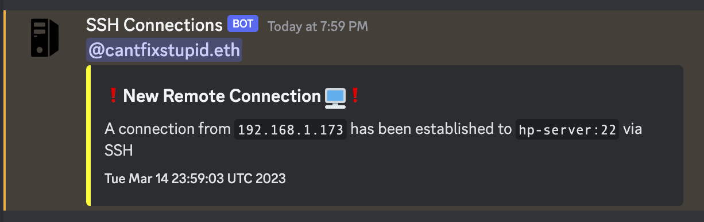

# Ubuntu-Login-Webhook

## Description
A bash script for sending @discord webhooks on login

## Usage
Place the `discord_webhook.sh` file into the `/etc/profile.d` with the appropriate variables configured inside the script

